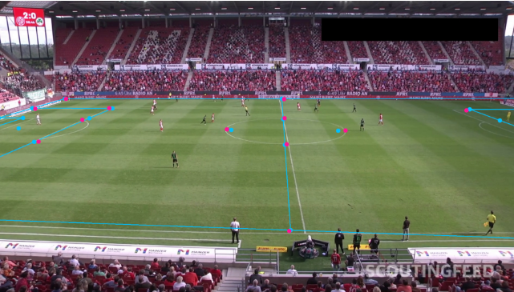
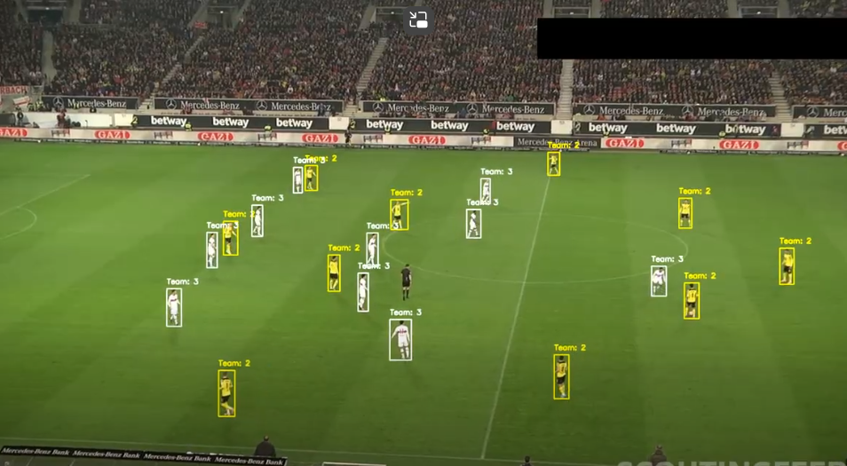
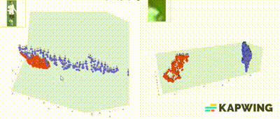

# Yolo-Football-Analysis
A YOLO-based project for detecting players, referees, the ball, and pitch elements in football footage, with game analysis and visualization on a 2D pitch projection.

# Football Game Analysis and Visualization Project

## Overview
This project provides a complete analysis and visualization system for football games, covering player tracking, ball movement, and pitch detection. By optimizing detection models and implementing targeted augmentations, we achieve high accuracy, supporting effective team classification and in-depth game strategy insights.

---

## Table of Contents
1. [Player Detection](#player-detection)
2. [Ball Detection](#ball-detection)
3. [Pitch Detection](#pitch-detection)
4. [Team Classification with UMAP](#team-classification-with-umap)

---

### Player Detection
To enhance robustness in diverse conditions (sunspots, zooming, non-standard backgrounds), the player detection model was fine-tuned with several key techniques:

- **Zoom-In/Zoom-Out Augmentation**: Adding zoom-based augmentations allows the model to adapt to various player sizes and distances from the camera, improving detection across different settings.
- **Brightness and Color Adjustments**: Simulated lighting effects replicate challenging real-world conditions, boosting model accuracy under different lighting scenarios.
- **Mosaic Augmentation**: Mosaic augmentation enhances the model's understanding of complex contexts by combining multiple images, helping to overcome memory limitations while keeping broader context awareness.

---

### Ball Detection
Separating the ball detection model from player detection has significantly increased accuracy, given the ball's smaller size and faster movement. Key improvements include:

- **Dedicated Ball Model**: A specialized ball model, trained on ball-specific data, improves accuracy, especially when the ball overlaps with players.
- **Advanced Augmentations**: Custom scaling and rotation augmentations help the model adapt to varying ball positions and orientations.

---

### Pitch Detection
Accurate pitch detection sets the foundation for player and ball positioning. By leveraging pitch-specific parameters and a dedicated model, we ensure consistent pitch detection, even under challenging lighting and background conditions.

.png)

---

### Team Classification with UMAP
UMAP (Uniform Manifold Approximation and Projection) enhances team classification by generating precise visualizations of team formations and player clusters. By combining UMAP with image cropping, which removes distracting background pixels around players, we achieve clearer, more accurate classification results.

- **Player Cropping**: Cropping background elements sharpens focus on each player’s relevant features, improving classification accuracy.
- **Team Clustering Video**: The video demonstrates successful team classification, with players correctly grouped by team and position.

## Future Work
Future improvements include real-time analysis capabilities, expanded classification for additional game events (e.g., tackles, fouls), and the integration of more visual insights for tactical analysis.

